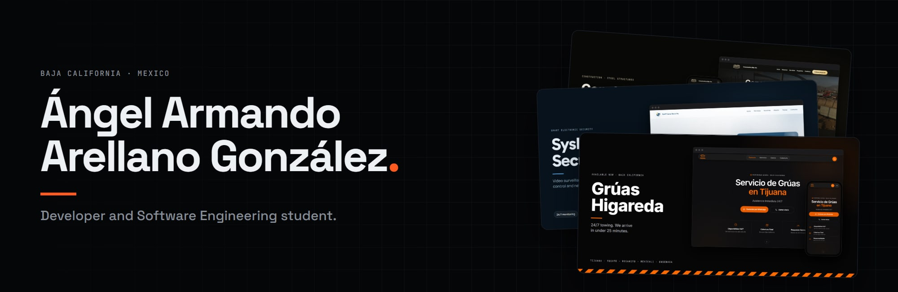
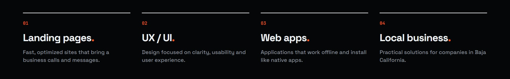
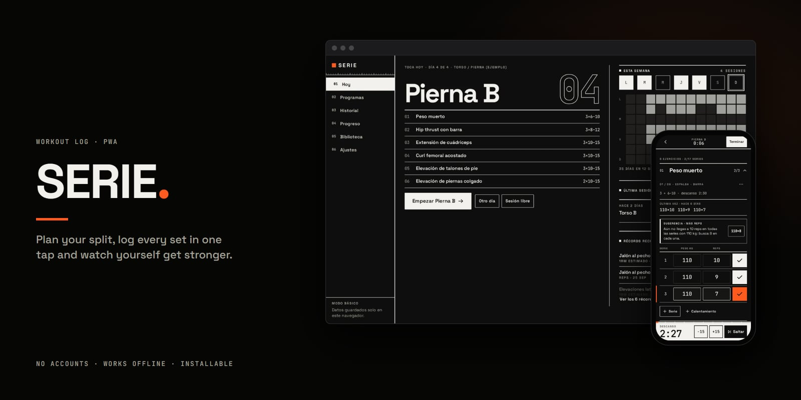
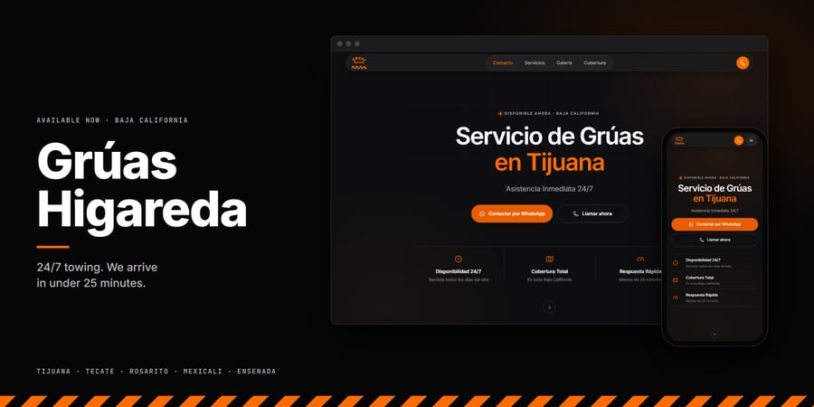
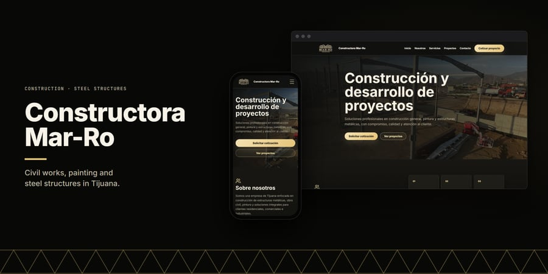
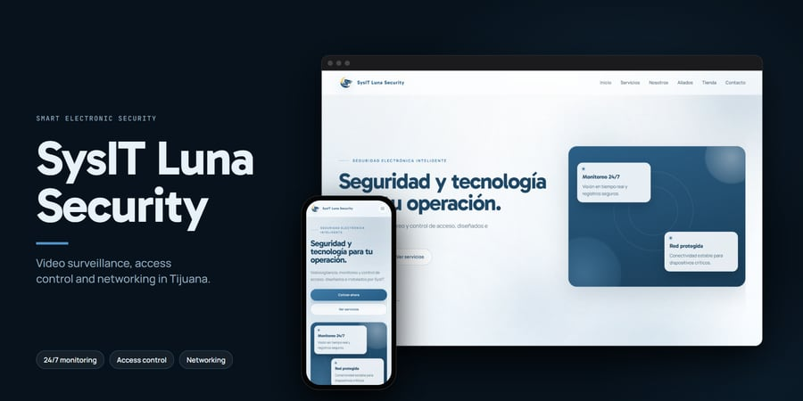
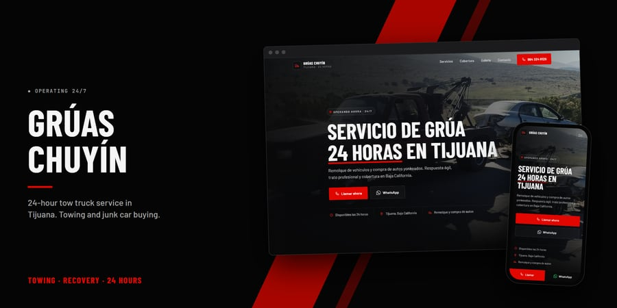
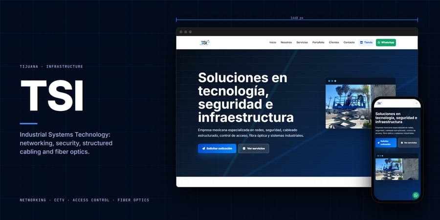
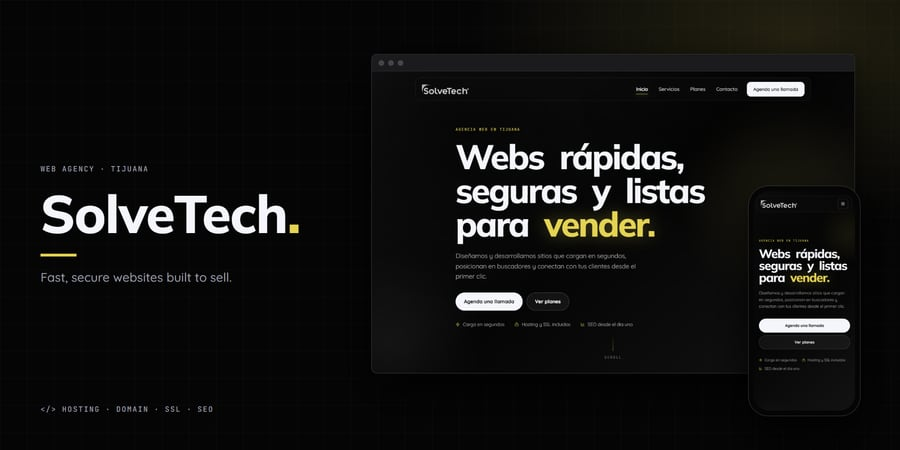

## About me

I design and build websites for businesses in Baja California, and web apps that work offline.

## Tech stack

## Featured project

**SERIE** · A web app to log gym workouts: sets, personal records and progress. No accounts, your data stays on your device; it installs like an app and works offline. 
React · TypeScript · Vite · IndexedDB · PWA

## Websites for businesses

<table>
  <tr>
    <td width="50%" valign="top">
      
      <b>Grúas Higareda</b> 
      24/7 towing in five cities across Baja California. Spanish and English.
    </td>
    <td width="50%" valign="top">
      
      <b>Constructora Mar-Ro</b> 
      Steel structures and civil works, with a project gallery.
    </td>
  </tr>
  <tr>
    <td width="50%" valign="top">
      
      <b>SysIT Luna Security</b> 
      Video surveillance and access control, with a product catalog.
    </td>
    <td width="50%" valign="top">
      
      <b>Grúas Chuyín</b> 
      24-hour tow truck service in Tijuana, one tap to call or WhatsApp.
    </td>
  </tr>
  <tr>
    <td width="50%" valign="top">
      
      <b>TSI</b> 
      Networking, structured cabling and industrial security.
    </td>
    <td width="50%" valign="top">
      
      <b>SolveTech</b> 
      Web design agency: services, plans and contact.
    </td>
  </tr>
</table>

## Contact

