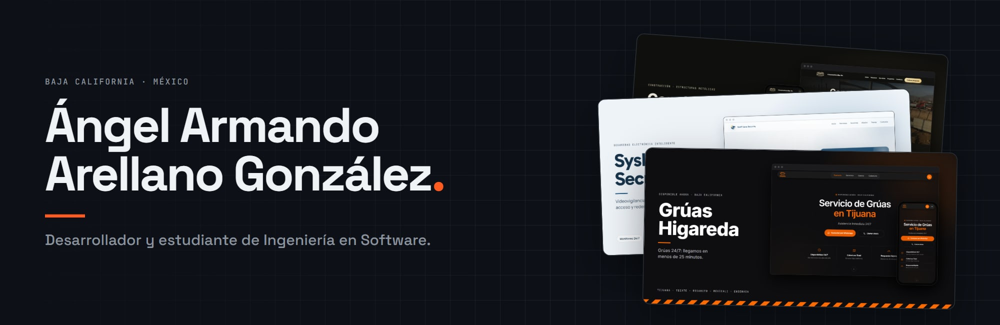
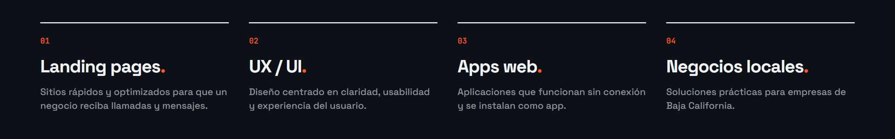
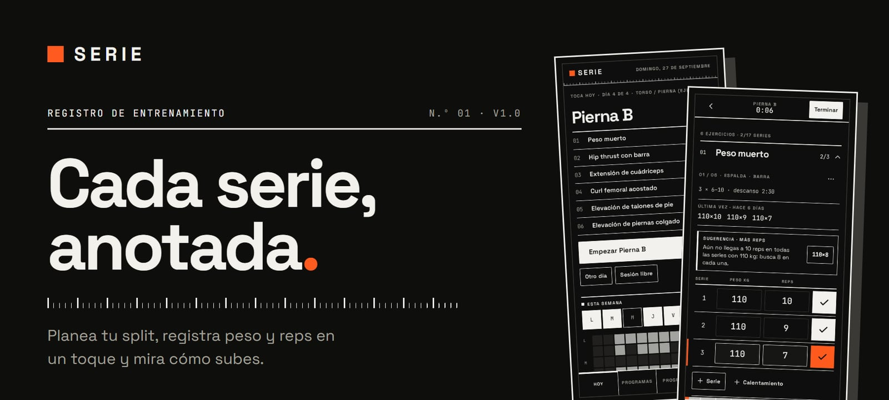
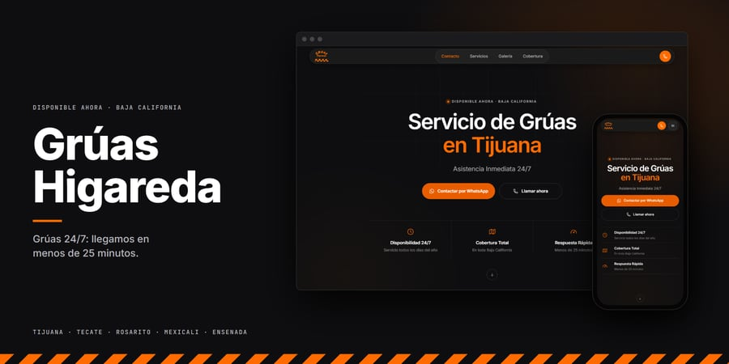
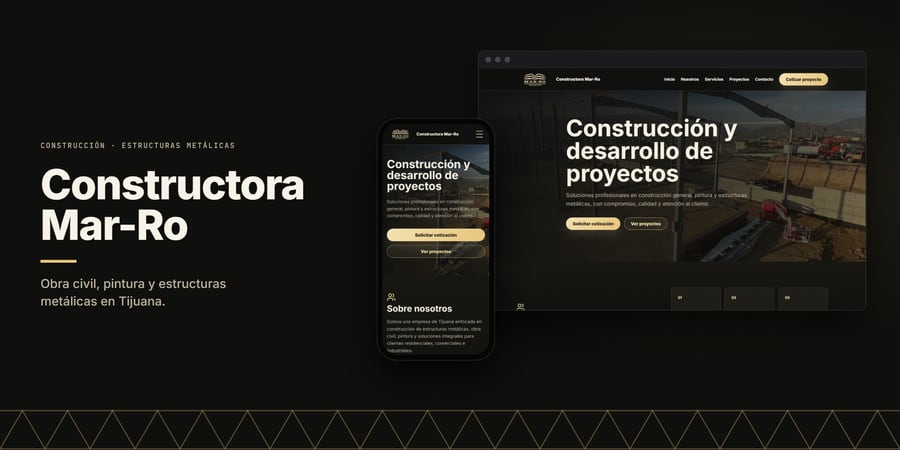
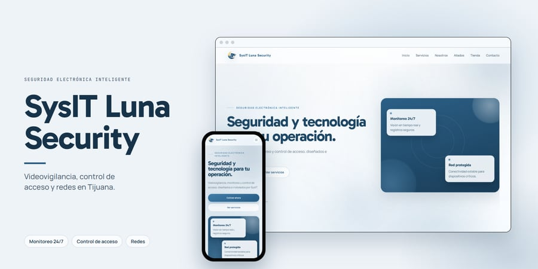
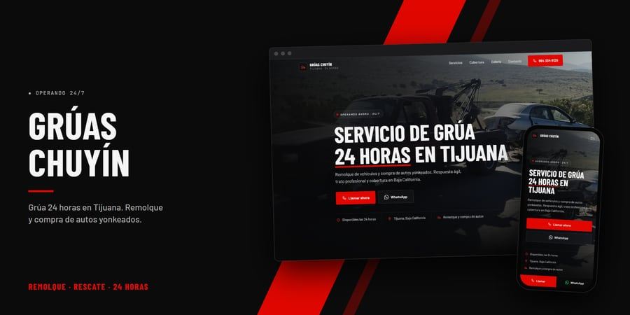
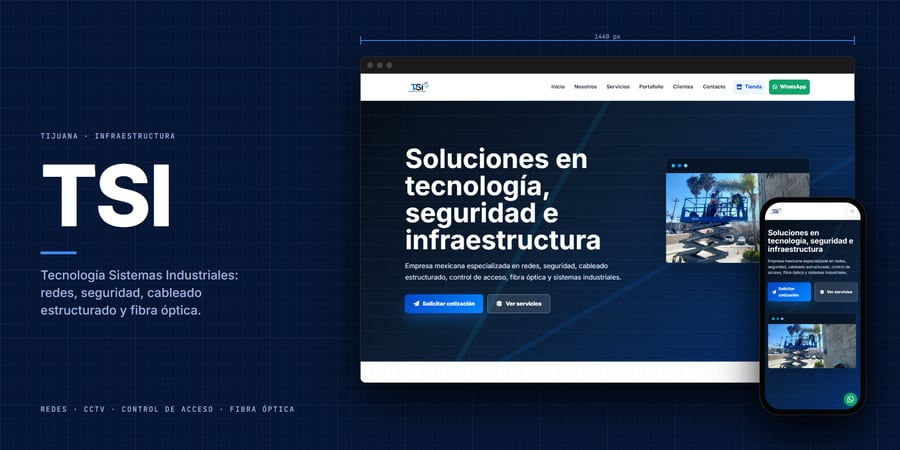
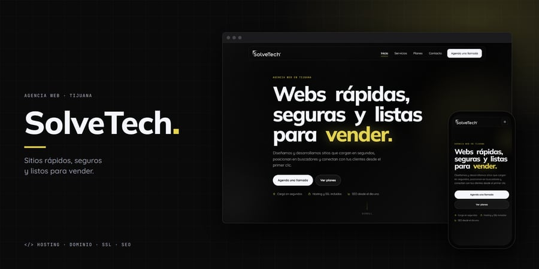

<picture>
  <source media="(prefers-color-scheme: dark)" srcset="assets/portada-oscuro.jpg">
  <source media="(prefers-color-scheme: light)" srcset="assets/portada-claro.jpg">
  
</picture>

## Sobre mí

Diseño y desarrollo sitios para negocios de Baja California y aplicaciones web que funcionan sin conexión.

<picture>
  <source media="(prefers-color-scheme: dark)" srcset="assets/enfoque-oscuro.jpg">
  <source media="(prefers-color-scheme: light)" srcset="assets/enfoque-claro.jpg">
  
</picture>

## Tecnologías

## Proyecto destacado

<a href="https://github.com/Salereee/SERIE">
  <picture>
    <source media="(prefers-color-scheme: dark)" srcset="assets/proyectos/SERIE.jpg">
    <source media="(prefers-color-scheme: light)" srcset="assets/proyectos/SERIE-claro.jpg">
    
  </picture>
</a>

**SERIE** · App web para registrar rutinas de gimnasio: series, récords y progreso. Sin cuentas, los datos se quedan en el dispositivo; se instala y funciona sin conexión. 
React · TypeScript · Vite · IndexedDB · PWA

## Sitios para negocios

<table>
  <tr>
    <td width="50%" valign="top">
      
      <b>Grúas Higareda</b> 
      Grúas 24/7 en cinco ciudades de Baja California. Español e inglés.
    </td>
    <td width="50%" valign="top">
      
      <b>Constructora Mar-Ro</b> 
      Estructuras metálicas y obra civil, con galería de proyectos.
    </td>
  </tr>
  <tr>
    <td width="50%" valign="top">
      
      <b>SysIT Luna Security</b> 
      Videovigilancia y control de acceso, con catálogo de productos.
    </td>
    <td width="50%" valign="top">
      
      <b>Grúas Chuyín</b> 
      Grúa 24 horas en Tijuana, con llamada y WhatsApp a un toque.
    </td>
  </tr>
  <tr>
    <td width="50%" valign="top">
      
      <b>TSI</b> 
      Redes, cableado estructurado y seguridad industrial.
    </td>
    <td width="50%" valign="top">
      
      <b>SolveTech</b> 
      Agencia de diseño web: servicios, planes y contacto.
    </td>
  </tr>
</table>

## Contacto

